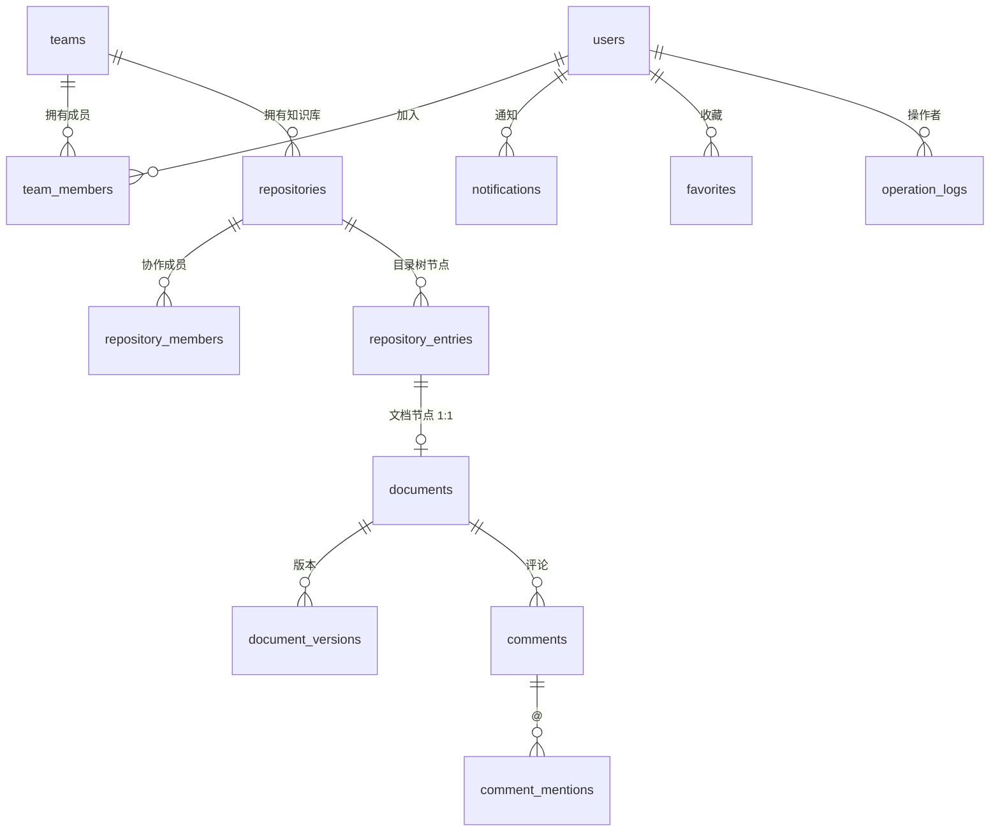

# 数据库表结构设计（PostgreSQL）

本文档与《技术选型》《语雀核心功能分析》《前端信息架构》对齐，面向 **MVP 首期** 落地，并预留二期能力扩展位。

**与 `Yuque_Backend` 已有表的关系**：§4.1 `users` 及 RBAC、文件、操作日志等与基座 **复用** 为主；自 **§4.2 `teams` 起为语雀业务新建表**。详见 [`database_baseline_table_mapping.md`](./database_baseline_table_mapping.md)。

---

## 1. 设计目标与约定

### 1.1 目标

- 支撑：**注册登录、个人/团队空间、知识库、多级目录、文档生命周期、权限继承与覆盖、评论与 @、站内通知、版本历史、回收站、标题/正文搜索（首版可用 PG）**。
- 与后端模块化划分一致：认证与用户、团队、知识库、文档、评论、权限、通知、审计（操作日志）。

### 1.2 约定

- **主键**：与 `Yuque_Backend` 基座一致，业务表统一使用 **`bigint`**，由应用层 **雪花（Snowflake）** 生成（对齐 `Yuque.EFCore.Entities.Entity`），不用数据库自增，便于分片预留与 ORM 一致。
- **命名**：表名、字段名均为 `snake_case`；表名用复数（与《技术选型》列举一致）。
- **时间**：`timestamptz`；必备 `created_at`，可变业务实体加 `updated_at`。
- **软删**：业务软删统一 `deleted_at timestamptz null`；回收站与「归档」通过状态字段区分（见下文）。
- **多租户边界**：团队协作以 `teams` 为边界；**个人空间**采用「每人一个 `type = personal` 的团队」模型，避免 `repositories` 上同时维护 `user_id` 与 `team_id` 两套归属逻辑。
- **无外键约束（与基座一致）**：语雀业务表 **不在数据库层创建 `FOREIGN KEY`**；表之间仅通过 **`bigint` 业务 id** 表达归属与引用，由应用层与 EF 模型维护一致性。对齐 `Yuque.EFCore` 中 `UseRemoveForeignKeys` 的既有策略；级联删除、存在性校验均在 **服务层 / 领域规则** 实现。

### 1.3 个人空间建模（推荐）

- 用户注册完成后，创建一条 `teams`：`type = personal`，`slug` 建议 `u-{user_id}`（`user_id` 为雪花 `bigint`）或用户可改的唯一 slug。
- 该用户写入 `team_members`，角色为 `owner`。
- 个人知识库即 `team_id = 该 personal team` 的 `repositories`。

组织型团队：`type = organization`，同样通过 `team_members` 管理成员。

### 1.4 正文存储约定（已定）

- `document_versions.body` 使用 **`jsonb`**，作为块编辑器（如 Tiptap / Slate）**文档树的权威存储**，与语雀式排版、分栏、卡片等能力一致。
- **Markdown / HTML**：可作为导入导出、剪贴板或只读渲染的**派生格式**，不替代 `jsonb` 主存。
- `documents.content_format` 用于标明 **JSON 形态 / 编辑器 schema**（如后续锁定 Tiptap 后写入 `tiptap_v2`），便于迁移与多版本共存；**不再**以 `markdown` 表示主存类型。

### 1.5 权限边界：RBAC 与内容 ACL（已定）

- **基座 RBAC**（`User` / `Role` / `Permission` / 菜单等）：仅用于 **管理类应用、系统设置、运营/审计后台** 等；不参与「某用户能否编辑某篇文档」的判定。
- **语雀业务内容权限**：由 **`repository_members`、`document_permissions`（若有）、`repositories.visibility` 及后续扩展表** 单独建模与校验；API 上建议 **独立授权中间件 / Handler**，与现有 RBAC Filter 分流（例如路由前缀 `/api/admin/*` vs `/api/content/*`）。

### 1.6 关联字段书写约定

字段说明中出现「逻辑关联 `xxx.id`」仅表示 **语义上的引用对象**，**不生成** PostgreSQL 的 `REFERENCES` 约束。需要加速查询处仍应建 **普通 B-tree / 唯一索引**（与是否为引用列无关）。

---

## 2. 实体关系概览



说明：**文件夹**与**文档**共用树表 `repository_entries`（`entry_type` 区分），文档详情在 `documents` + `document_versions`，避免在文件夹行上冗余版本数据。图中连线表示 **业务关系**，库表 **无外键**（见 §1.2）。

---

## 3. 枚举类型（建议独立 TYPE，便于 ORM 映射）

```sql
-- 团队类型：个人空间 vs 组织
CREATE TYPE team_type AS ENUM ('personal', 'organization');

-- 团队成员角色
CREATE TYPE team_member_role AS ENUM ('owner', 'admin', 'member', 'guest');

-- 知识库可见性（与产品「可见性策略」对齐，首版可只实现子集）
CREATE TYPE repository_visibility AS ENUM (
  'private',           -- 仅成员
  'team',              -- 团队内（对个人库即仅自己）
  'public'             -- 公开可读（可选）
);

-- 目录树节点类型
CREATE TYPE repository_entry_type AS ENUM ('folder', 'document');

-- 文档业务状态（不含回收站：回收站由 deleted_at 表达）
CREATE TYPE document_status AS ENUM ('draft', 'published', 'archived');

-- 知识库成员角色（库级 ACL）
CREATE TYPE repository_member_role AS ENUM ('viewer', 'editor', 'admin');

-- 文档级授权（覆盖继承时使用）
CREATE TYPE document_grant_permission AS ENUM ('view', 'comment', 'edit', 'admin');

-- 评论状态
CREATE TYPE comment_status AS ENUM ('open', 'resolved');

-- 通知类型（可扩展，payload 在 JSONB）
CREATE TYPE notification_type AS ENUM (
  'comment',
  'mention',
  'permission',
  'share',
  'system'
);

-- 收藏对象类型
CREATE TYPE favorite_target_type AS ENUM ('repository', 'document');

-- 操作日志动作（示例，可按模块增补）
CREATE TYPE operation_action AS ENUM (
  'user.login',
  'user.logout',
  'repository.create',
  'repository.update',
  'repository.delete',
  'document.create',
  'document.update',
  'document.publish',
  'document.move',
  'document.delete',
  'document.restore',
  'comment.create',
  'member.invite',
  'member.role_change'
);
```

---

## 4. 表清单与字段

### 4.1 `users` — 用户

| 字段 | 类型 | 说明 |
|------|------|------|
| id | bigint PK | |
| email | citext UNIQUE | 登录；`citext` 需扩展 `citext`，若无可用 `varchar` + 应用层小写 |
| password_hash | varchar(255) | argon2/bcrypt 等 |
| display_name | varchar(100) | 昵称 |
| avatar_url | varchar(500) | 可空 |
| locale | varchar(20) | 默认 `zh-CN` |
| is_active | boolean | 默认 true |
| is_platform_admin | boolean | 超级管理员标记，默认 false |
| last_login_at | timestamptz | 可空 |
| created_at | timestamptz | |
| updated_at | timestamptz | |

索引：`email`；可选 `(is_active) where deleted 无则不加`。

> **与基座对齐**：`Yuque_Backend` 已存在 `User` 实体（主键为雪花 `bigint`）时，**不必重复建库表**；语雀扩展域所有 `user_id` / `created_by` 等 **业务 id 语义上对应 `User.Id`**，不设 DB 外键。本节字段表可作为「若独立用户域」的逻辑参考，列名与基座 ORM 不一致时以映射层为准。

---

### 4.2 `teams` — 团队（含个人空间）

| 字段 | 类型 | 说明 |
|------|------|------|
| id | bigint PK | |
| type | team_type NOT NULL | personal / organization |
| name | varchar(200) NOT NULL | 个人空间可默认「某某的知识空间」 |
| slug | varchar(100) NOT NULL UNIQUE | URL 与展示用 |
| description | text | 可空 |
| avatar_url | varchar(500) | 可空 |
| owner_user_id | bigint NOT NULL | 逻辑关联基座 `User.Id`，主负责人 |
| settings | jsonb | 扩展配置 |
| deleted_at | timestamptz | 软删团队（慎用） |
| created_at | timestamptz | |
| updated_at | timestamptz | |

约束建议：`type = personal` 时，应用层或部分唯一索引保证 **每个用户最多一个 personal team**（见下节索引）。

部分唯一索引示例：

```sql
CREATE UNIQUE INDEX ux_teams_one_personal_per_user
  ON teams (owner_user_id)
  WHERE type = 'personal' AND deleted_at IS NULL;
```

---

### 4.3 `team_members` — 团队成员

| 字段 | 类型 | 说明 |
|------|------|------|
| id | bigint PK | |
| team_id | bigint NOT NULL | 逻辑关联 `teams.id` |
| user_id | bigint NOT NULL | 逻辑关联 `User.Id` |
| role | team_member_role NOT NULL | |
| invited_by | bigint | 逻辑关联 `User.Id`，可空 |
| joined_at | timestamptz NOT NULL default now() | |
| created_at | timestamptz | |

唯一：`(team_id, user_id)`。

索引：`team_id`，`user_id`。

---

### 4.4 `repositories` — 知识库

| 字段 | 类型 | 说明 |
|------|------|------|
| id | bigint PK | |
| team_id | bigint NOT NULL | 逻辑关联 `teams.id` |
| name | varchar(200) NOT NULL | |
| slug | varchar(150) NOT NULL | **团队内唯一**，见索引 |
| description | text | |
| cover_url | varchar(500) | |
| visibility | repository_visibility NOT NULL default 'private' | |
| settings | jsonb | 导航、导出策略等扩展 |
| archived_at | timestamptz | 归档 |
| deleted_at | timestamptz | 软删 |
| created_by | bigint | 逻辑关联 `User.Id` |
| created_at | timestamptz | |
| updated_at | timestamptz | |

唯一：`(team_id, slug) WHERE deleted_at IS NULL`。

索引：`team_id`，`(visibility) WHERE deleted_at IS NULL`（公开列表若需要）。

---

### 4.5 `repository_members` — 知识库成员（协作）

用于「邀请协作的」知识库授权，与个人默认权限叠加由应用层解析（通常：库 owner = 团队对该库的管理者）。

| 字段 | 类型 | 说明 |
|------|------|------|
| id | bigint PK | |
| repository_id | bigint NOT NULL | 逻辑关联 `repositories.id` |
| user_id | bigint NOT NULL | 逻辑关联 `User.Id` |
| role | repository_member_role NOT NULL | |
| invited_by | bigint | 逻辑关联 `User.Id`，可空 |
| created_at | timestamptz | |

唯一：`(repository_id, user_id)`。

---

### 4.6 `repository_entries` — 知识库目录树（文件夹 + 文档占位节点）

| 字段 | 类型 | 说明 |
|------|------|------|
| id | bigint PK | |
| repository_id | bigint NOT NULL | 逻辑关联 `repositories.id` |
| parent_id | bigint | 逻辑关联 `repository_entries.id`，根节点为 NULL |
| entry_type | repository_entry_type NOT NULL | folder / document |
| title | varchar(500) NOT NULL | 列表与树展示 |
| slug | varchar(200) NOT NULL | **同一 parent 下唯一** |
| sort_order | int NOT NULL default 0 | 同级排序 |
| deleted_at | timestamptz | 进入回收站 |
| created_by | bigint | 逻辑关联 `User.Id` |
| updated_by | bigint | 逻辑关联 `User.Id` |
| created_at | timestamptz | |
| updated_at | timestamptz | |

唯一：`(repository_id, parent_id, slug) WHERE deleted_at IS NULL)` — PostgreSQL 中 `parent_id` 为 NULL 时可用 **`coalesce(parent_id, 0)`** 参与唯一索引（雪花 ID 不为 `0`，`0` 仅作根节点占位）；或拆「根级 / 非根」两条部分唯一索引。**推荐**应用层保证同级 `slug` 不冲突并与索引一致。

索引：`(repository_id, parent_id) WHERE deleted_at IS NULL`，`repository_id` + `updated_at`（最近更新列表）。

---

### 4.7 `documents` — 文档业务表（与 entry 1:1）

仅 `entry_type = document` 的节点有对应行。

| 字段 | 类型 | 说明 |
|------|------|------|
| id | bigint PK | 可与 `repository_entry_id` 合并二选一；此处采用独立 id 并强制唯一 entry |
| repository_entry_id | bigint NOT NULL UNIQUE | 逻辑关联 `repository_entries.id`，库内唯一 |
| repository_id | bigint NOT NULL | 逻辑关联 `repositories.id`，与 entry 同步冗余 |
| status | document_status NOT NULL default 'draft' | |
| published_at | timestamptz | 可空 |
| current_version_id | bigint | 逻辑关联 `document_versions.id`，当前版本指针 |
| content_format | varchar(50) NOT NULL default 'block_json' | 与 `body` 的 JSON schema 对齐，锁定编辑器后改为具体标识（如 `tiptap_v2`） |
| properties | jsonb | 封面、摘要、标签缓存等 |
| created_at | timestamptz | |
| updated_at | timestamptz | |

说明：**正文**不进此表，只在 `document_versions`；`current_version_id` 仅存业务指针，**无 DB 外键**，版本写入与指针更新在同一事务或领域服务内保证一致。

索引：`repository_id`，`(repository_id, status)`。

---

### 4.8 `document_versions` — 文档版本

| 字段 | 类型 | 说明 |
|------|------|------|
| id | bigint PK | |
| document_id | bigint NOT NULL | 逻辑关联 `documents.id` |
| version_no | int NOT NULL | 从 1 递增 |
| author_id | bigint NOT NULL | 逻辑关联 `User.Id` |
| title | varchar(500) NOT NULL | 快照 |
| body | jsonb NOT NULL | 块编辑器文档 JSON（权威存储，见 §1.4） |
| body_search | tsvector | 由应用或触发器从 `body` 抽取纯文本后写入，用于 FTS（可选，见 §6） |
| change_note | varchar(500) | 版本说明 |
| created_at | timestamptz NOT NULL default now() | |

唯一：`(document_id, version_no)`。

索引：`document_id`，`body_search` GIN（若使用 tsvector）。

---

### 4.9 `document_permissions` — 文档级权限覆盖（可选 MVP）

若 MVP 只做「库级角色 + 继承」，可先不建表，仅保留产品接口。建议 **首期即建表**，无行表示完全继承。

| 字段 | 类型 | 说明 |
|------|------|------|
| id | bigint PK | |
| document_id | bigint NOT NULL | 逻辑关联 `documents.id` |
| user_id | bigint NOT NULL | 逻辑关联 `User.Id` |
| permission | document_grant_permission NOT NULL | |
| created_by | bigint | 逻辑关联 `User.Id` |
| created_at | timestamptz | |

唯一：`(document_id, user_id)`。

---

### 4.10 `comments` — 评论

| 字段 | 类型 | 说明 |
|------|------|------|
| id | bigint PK | |
| document_id | bigint NOT NULL | 逻辑关联 `documents.id` |
| repository_entry_id | bigint | 逻辑关联 `repository_entries.id`，冗余可加快列表；可选 |
| parent_id | bigint | 逻辑关联 `comments.id`，回复楼中楼 |
| author_id | bigint NOT NULL | 逻辑关联 `User.Id` |
| body | text NOT NULL | |
| anchor | jsonb | 段落定位、块 id 等 |
| status | comment_status NOT NULL default 'open' | |
| deleted_at | timestamptz | |
| created_at | timestamptz | |
| updated_at | timestamptz | |

索引：`document_id`，`parent_id`。

---

### 4.11 `comment_mentions` — 评论中的 @

| 字段 | 类型 | 说明 |
|------|------|------|
| id | bigint PK | |
| comment_id | bigint NOT NULL | 逻辑关联 `comments.id` |
| mentioned_user_id | bigint NOT NULL | 逻辑关联 `User.Id` |
| created_at | timestamptz | |

唯一：`(comment_id, mentioned_user_id)`；索引 `mentioned_user_id`（查「与我相关」）。

---

### 4.12 `attachments` — 附件元数据（已定新建）

**不复用**基座 `File` 表；语雀编辑器与知识库附件统一走本表，对象实体仍在对象存储，库内仅存元数据。

| 字段 | 类型 | 说明 |
|------|------|------|
| id | bigint PK | |
| repository_id | bigint NOT NULL | 逻辑关联 `repositories.id` |
| document_id | bigint | 逻辑关联 `documents.id`，可空表示库级资源 |
| uploader_id | bigint NOT NULL | 逻辑关联 `User.Id` |
| storage_key | varchar(500) NOT NULL | 对象存储路径 |
| file_name | varchar(500) NOT NULL | |
| mime_type | varchar(200) | |
| size_bytes | bigint NOT NULL | |
| checksum | varchar(128) | |
| deleted_at | timestamptz | |
| created_at | timestamptz | |

索引：`document_id`，`repository_id`。

---

### 4.13 `notifications` — 站内通知

| 字段 | 类型 | 说明 |
|------|------|------|
| id | bigint PK | |
| user_id | bigint NOT NULL | 逻辑关联 `User.Id`，接收人 |
| type | notification_type NOT NULL | |
| title | varchar(300) | |
| body | text | 可空 |
| payload | jsonb | 跳转所需 document_id、comment_id 等 |
| read_at | timestamptz | |
| created_at | timestamptz NOT NULL default now() | |

索引：`(user_id, read_at, created_at desc)`。

---

### 4.14 `favorites` — 收藏

| 字段 | 类型 | 说明 |
|------|------|------|
| id | bigint PK | |
| user_id | bigint NOT NULL | 逻辑关联 `User.Id` |
| target_type | favorite_target_type NOT NULL | |
| repository_id | bigint | 逻辑关联 `repositories.id`，target 为 repository 时必填 |
| repository_entry_id | bigint | 逻辑关联 `repository_entries.id`，target 为 document 时必填 |
| created_at | timestamptz | |

约束：CHECK 保证 `target_type` 与对应 id 一致（应用层 + 数据库 CHECK）。

唯一：例如收藏文档：`(user_id, repository_entry_id) WHERE repository_entry_id IS NOT NULL`；收藏库：`(user_id, repository_id)`。

---

### 4.15 `tags` / `document_tags` — 标签（可选 MVP）

**tags**：`id` bigint PK，`team_id` / `user_id` bigint（逻辑关联 `teams.id` 或 `User.Id`），`name`，`slug`，`created_at`。  
**document_tags**：`document_id`、`tag_id` bigint（逻辑关联 `documents.id`、`tags.id`），联合主键。

若首版不做标签，可省略。

---

### 4.16 `share_links` — 外部分享（扩展位）

| 字段 | 类型 | 说明 |
|------|------|------|
| id | bigint PK | |
| token_hash | varchar(128) NOT NULL UNIQUE | 仅存 hash |
| target_type | varchar(30) NOT NULL | repository / document |
| repository_id | bigint | |
| repository_entry_id | bigint | |
| password_hash | varchar(255) | 可空 |
| expire_at | timestamptz | |
| settings | jsonb | 禁导出、禁评论等 |
| created_by | bigint NOT NULL | 逻辑关联 `User.Id` |
| revoked_at | timestamptz | |
| created_at | timestamptz | |

MVP 可不实现写入，仅表结构预留。

---

### 4.17 `operation_logs` — 操作审计

| 字段 | 类型 | 说明 |
|------|------|------|
| id | bigint PK | 与业务表一致，雪花生成 |
| actor_id | bigint | 逻辑关联 `User.Id`，可空表示系统 |
| action | operation_action 或 varchar(100) | 枚举强类型或宽松字符串二选一 |
| resource_type | varchar(50) NOT NULL | repository, document, comment… |
| resource_id | bigint | 与对应资源主键同型 |
| metadata | jsonb | IP、UA、diff 摘要等 |
| created_at | timestamptz NOT NULL default now() | |

索引：`(resource_type, resource_id, created_at desc)`，`(actor_id, created_at desc)`。

---

### 4.18 认证相关（若会话落库）

**refresh_tokens**（可选）：`id`, `user_id`（逻辑关联 `User.Id`，无 DB 外键）, `token_hash`, `expires_at`, `created_at`, `revoked_at`, `user_agent`, `ip`。

若采用纯 JWT 无刷新存库，可省略；亦可继续仅用基座 **`UserToken`**。

---

## 5. 回收站与恢复

- **知识库 / 树节点 / 文档**：统一用 `deleted_at IS NOT NULL` 表示进入回收站。
- **列表默认**：`WHERE deleted_at IS NULL`。
- **回收站列表**：`WHERE deleted_at IS NOT NULL`，可按 `deleted_at` 排序。
- **恢复**：`deleted_at = NULL`；若需保留删除人，可加 `deleted_by bigint` 字段（建议加上）。

---

## 6. 搜索（MVP）

- **标题**：`repository_entries.title`、`document_versions.title` 可对 `pg_trgm` GIN 或 `ILIKE`（小数据量）。
- **正文**：`body` 为 `jsonb`，全文检索不直接对 JSON 键路径做模糊搜索；在 **发布** 或 **保存版本** 时从 `body` **抽取纯文本**写入 `body_search`（`tsvector`），仅索引当前对外可见版本（历史版本是否纳入可按产品定）。抽取逻辑与编辑器 schema 绑定，宜放在应用层或独立小服务，必要时再用 `document_search_index` 表解耦。

扩展位：二期对接 Elasticsearch 时，可用 Outbox 表同步，不必推翻关系模型。

---

## 7. 与 .NET 模块的对应关系

| 模块 | 主要表 |
|------|--------|
| 认证与用户 | users，（可选 refresh_tokens） |
| 团队与组织 | teams, team_members |
| 知识库 | repositories, repository_members |
| 文档 | repository_entries, documents, document_versions, document_permissions |
| 评论 | comments, comment_mentions |
| 内容权限（非 RBAC） | repository_members, document_permissions, repositories.visibility |
| 通知 | notifications |
| 搜索 | document_versions（+ 索引策略） |
| 审计 | operation_logs |
| 附件 | attachments |
| 收藏 | favorites |
| 分享（预留） | share_links |

---

## 8. 实施顺序建议

1. 扩展与枚举：`citext`（可选）、枚举 TYPE。  
2. 用户与团队：`users` → `teams` → `team_members`（注册事务内创建 personal team）。  
3. 知识库：`repositories` → `repository_members`。  
4. 内容树与文档：`repository_entries` → `documents` → `document_versions`。  
5. 协作：`comments` → `comment_mentions` → `notifications`。  
6. 附属：`attachments`、`favorites`、`operation_logs`。  
7. 按需：`share_links`、标签、`tsvector` 与触发器。

---

## 9. 结论

- **可以先做、且应该尽早固定** 的是：团队与个人空间边界、`repository_entries` 树 + `document_versions` 正文模型、库级/文档级权限表、评论与通知关联。  
- **主键与基座一致**：业务表 **`bigint` + 雪花**，与 `Yuque_Backend` 的 `Entity` 基类一致；**`document_versions.body` 为 `jsonb`**；编辑器在 Tiptap / Slate 间选择，主要影响 **JSON schema 与 `documents.content_format` 取值**。  
- **RBAC 与内容 ACL 分离**（见 §1.5）：基座角色权限只管管理端；文档/知识库授权走独立表与中间件。  
- 使用 **EF Core** 时，将 `body` 映射为 `JsonDocument` / `JsonElement` 或带 `[JsonPropertyName]` 的 POCO 均可；Npgsql 对 `jsonb` 支持成熟。  
- **迁移层不生成外键**：实体上可用导航属性表达关系，但 **`OnModelCreating` 中勿 `HasOne...WithMany` 配 `OnDelete` 落库约束**，或与基座一致使用自定义迁移 SQL 生成器剔除 FK，保证库中仅有业务 id 列 + 索引。

若仍希望仓库内保留一份 **可执行的 `*.sql` 参考脚本**（便于 DBA 审阅或与迁移对照），可单独提出，与 EF Core 迁移可二选一或并存。
