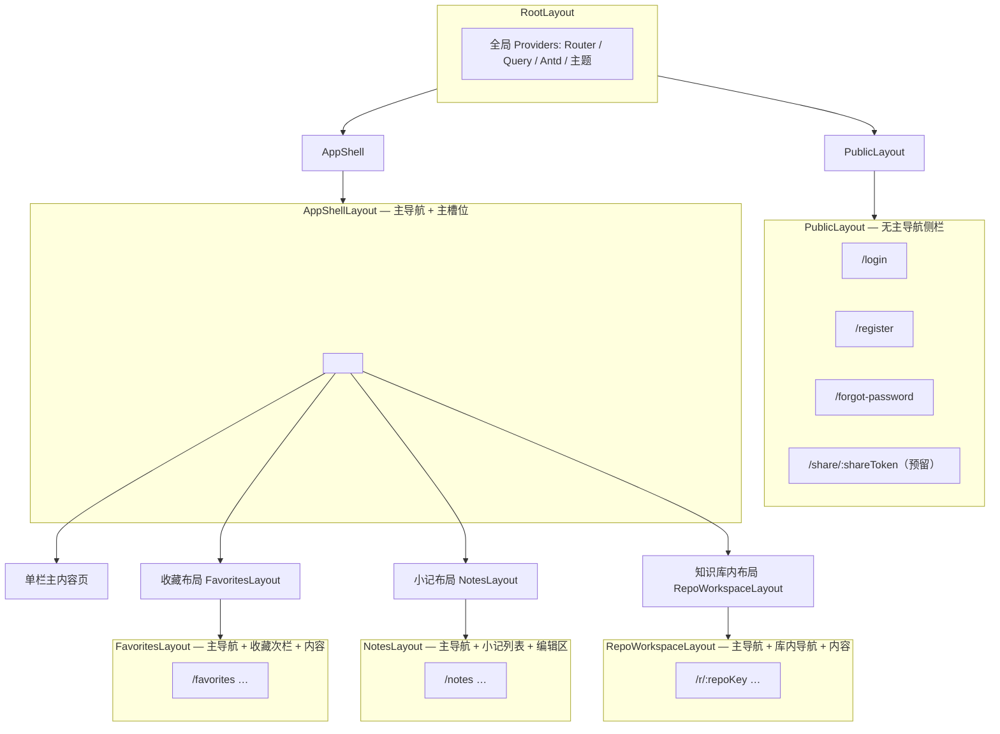

# 前端信息架构：路由表与布局层级

本文档在《技术选型》《语雀核心功能分析》与 `docs/Prototyping` 原型基础上，约定首版可落地的 **URL 结构**、**布局嵌套** 与 **扩展位**。路径段使用英文小写 + 连字符，便于工程实现与国际化；界面文案仍可为中文。

---

## 1. 设计原则

- **壳层一致**：登录后绝大部分业务页共用「全局左侧导航 + 主内容区」的 `AppShell`，与原型中语雀式 IA 一致。
- **按信息密度拆布局**：仅当页面需要第二或第三栏时，在 `AppShell` 内再套专用布局（收藏、小记、知识库内），避免全局侧栏重复实现。
- **资源标识**：知识库与文档在 URL 中应可被分享与刷新恢复；首版可用 `slug` 或 `id`，前后端对齐即可（下表用 `:repoKey`、`:docKey` 表示「库 / 文档的稳定键」）。
- **团队空间**：侧边栏「空间切换」可先只做状态（Zustand），URL 上预留 `teams` 命名空间，避免日后大面积改路由。

---

## 2. 布局层级总览

### 2.1 树状结构



### 2.2 各布局职责

| 布局组件 | 职责 | 典型区域划分 |
|----------|------|----------------|
| `RootLayout` | 挂载全局 Provider、错误边界可选 | 整页 |
| `PublicLayout` | 未登录或弱会话页：居中表单、品牌区 | 主列居中 |
| `AppShellLayout` | 全局侧栏：Logo / 空间切换、搜索、快捷 `+`、`开始` / `小记` / `收藏`、知识库列表、底部运营位 | 左固定宽 + 右 `flex:1` |
| `FavoritesLayout` | 在 `AppShell` 主槽内增加「收藏」次级侧栏（全部收藏、分组等） | 次栏 + 表格/列表区 |
| `NotesLayout` | 三栏：小记列表 + 右侧编辑器（与原型一致） | 列表窄栏 + 编辑区自适应 |
| `RepoWorkspaceLayout` | 知识库内：库顶栏（标题、统计、收藏/分享/更多）+ 库内左侧「首页 / 目录树」+ 主内容 | 库内左栏 + 主列 |

---

## 3. 路由表

### 3.1 图例

- **布局列**：对应 React Router 的父路由 `element` 嵌套。
- **鉴权**：`公开` 任意访问；`需登录` 未登录重定向至 `/login`（`returnUrl` 可 query 携带）。

### 3.2 公开路由

| 路径 | 布局 | 鉴权 | 页面说明 |
|------|------|------|----------|
| `/login` | `PublicLayout` | 公开 | 登录 |
| `/register` | `PublicLayout` | 公开 | 注册 |
| `/forgot-password` | `PublicLayout` | 公开 | 找回密码 |
| `/share/:shareToken` | `PublicLayout` 或独立极简壳 | 公开 | 外部分享阅读（与《分享能力》对齐，实现可后置） |

### 3.3 已登录主壳内 — 单栏主内容（`AppShell` → 单栏）

| 路径 | 布局 | 鉴权 | 页面说明 |
|------|------|------|----------|
| `/` | `AppShell` | 需登录 | 重定向到 `/home` |
| `/home` | `AppShell` | 需登录 | **开始**：快捷入口 + 最近文档列表（对应 `start.png`） |
| `/knowledge-bases` | `AppShell` | 需登录 | **知识库聚合**：常用 / Tab / 卡片或列表（对应 `dashboard.png`） |
| `/ai-writing` | `AppShell` | 需登录 | **AI 写作**占位（原型有；首版可空态 + 说明） |
| `/traffic` | `AppShell` | 需登录 | **流量 / 统计**占位（与原型「流量」一致；功能可二期） |
| `/recycle-bin` | `AppShell` | 需登录 | **回收站**（全局或「我删除的内容」入口，与收藏原型侧栏一致） |
| `/search` | `AppShell` | 需登录 | **全局搜索**独立结果页（侧栏「Ctrl+K」可打开弹层或跳转此页，实现时二选一） |
| `/settings` | `AppShell` | 需登录 | **设置**首页，子路由见下表 |
| `/settings/profile` | `AppShell` | 需登录 | 个人资料 |
| `/settings/account` | `AppShell` | 需登录 | 账号与安全 |
| `/settings/notifications` | `AppShell` | 需登录 | 通知偏好 |

### 3.4 收藏（`AppShell` → `FavoritesLayout`）

| 路径 | 布局 | 鉴权 | 页面说明 |
|------|------|------|----------|
| `/favorites` | `FavoritesLayout` | 需登录 | 默认「全部收藏」列表（对应 `收藏.png`） |
| `/favorites/folders/:folderId` | `FavoritesLayout` | 需登录 | 某收藏分组（首版可无数据，路由预留） |

### 3.5 小记（`AppShell` → `NotesLayout`）

| 路径 | 布局 | 鉴权 | 页面说明 |
|------|------|------|----------|
| `/notes` | `NotesLayout` | 需登录 | 未选中小记时的空态或自动选第一条（对应 `小记页面.png`） |
| `/notes/:noteId` | `NotesLayout` | 需登录 | 右侧编辑器展示该条；中间列表高亮当前项 |

### 3.6 知识库内（`AppShell` → `RepoWorkspaceLayout`）

前缀使用 `/r/:repoKey`，短且稳定；`repoKey` 可为 slug 或雪花 id 字符串。

| 路径 | 布局 | 鉴权 | 页面说明 |
|------|------|------|----------|
| `/r/:repoKey` | `RepoWorkspaceLayout` | 需登录 | **知识库首页**：简介、统计、文档/目录总览（对应 `知识库.png` 主区） |
| `/r/:repoKey/catalog` | `RepoWorkspaceLayout` | 需登录 | **目录**视图：与侧栏树互补的全页目录或重定向合并到首页锚点（实现时择一） |
| `/r/:repoKey/d/:docKey` | `RepoWorkspaceLayout` | 需登录 | **文档阅读 / 编辑**：同一布局下切换阅读态与编辑态（URL 不变或加 `?mode=edit`，细节在编辑器方案定型后定） |
| `/r/:repoKey/settings` | `RepoWorkspaceLayout` | 需登录 | 当前知识库设置（成员、可见性、导出策略等，首版可占位） |

### 3.7 团队空间（预留，与《团队管理》对齐）

首版若不做独立团队路由，可通过「当前团队」上下文访问仍落在个人 `/r/...` 下；以下建议在路由层一次性占位：

| 路径 | 布局 | 鉴权 | 页面说明 |
|------|------|------|----------|
| `/teams` | `AppShell` | 需登录 | 团队列表 / 我加入的团队 |
| `/teams/:teamKey` | `AppShell` 或 `TeamShellLayout`（可选） | 需登录 | 团队概览 |
| `/teams/:teamKey/knowledge-bases` | 同上 | 需登录 | 团队维度知识库列表 |
| `/teams/:teamKey/r/:repoKey` | `RepoWorkspaceLayout`（团队上下文） | 需登录 | 团队库内与 `/r/...` 同布局，便于权限中间件区分 namespace |

> **实现建议**：`RepoWorkspaceLayout` 读取 `params.repoKey` + 可选「当前空间类型（personal \| team）」与 `teamKey`，由布局在加载库元信息时一并请求。

---

## 4. React Router 嵌套顺序（实现参考）

以下为推荐嵌套顺序（伪代码级，便于与 `createBrowserRouter` 对齐）：

```text
/ (RootLayout)
├── public/* → PublicLayout
│   ├── login, register, forgot-password, share/:shareToken
└── (auth) → AppShellLayout
    ├── home, knowledge-bases, ai-writing, traffic, recycle-bin, search
    ├── settings, settings/*
    ├── teams, teams/:teamKey, …（预留）
    ├── favorites → FavoritesLayout → favorites/* 
    ├── notes → NotesLayout → notes, notes/:noteId
    └── r/:repoKey → RepoWorkspaceLayout → r/:repoKey, r/:repoKey/d/:docKey, …
```

未登录访问 `需登录` 路由时：**整页替换为登录页**或 **保留意图 URL 登录后跳回**，产品一致即可。

---

## 5. 与原型图的映射

| 原型文件 | 主路由 | 布局组合 |
|----------|--------|----------|
| `start.png` | `/home` | `AppShell` |
| `dashboard.png` | `/knowledge-bases` | `AppShell` |
| `知识库.png` | `/r/:repoKey`（及子路由文档） | `AppShell` + `RepoWorkspaceLayout` |
| `收藏.png` | `/favorites` | `AppShell` + `FavoritesLayout` |
| `小记页面.png` | `/notes`, `/notes/:noteId` | `AppShell` + `NotesLayout` |

---

## 6. 后续可补充文档（不在本文展开）

- 全局命令面板（Ctrl+K）与 `/search` 是否合并为同一数据源。
- 文档编辑 URL 策略（`?mode=` vs 独立 `/edit`）。
- `teams` 与 personal 的 `repoKey` 全局唯一性约定（是否加 team 前缀）。

---

## 7. 结论

- **主壳**：`AppShellLayout` 覆盖工作台、知识库列表、设置等单栏页。
- **三套增值布局**：`FavoritesLayout`、`NotesLayout`、`RepoWorkspaceLayout` 仅在对应路由段挂载，避免其它页面承担多余栏位。
- **路由前缀**：`/home`、`/knowledge-bases`、`/r/:repoKey`、`/notes`、`/favorites` 构成 MVP 核心动线；`/teams/*` 与 `/share/:shareToken` 为扩展位。

该表可直接作为初始化 `src/routes` 或 `app/router.tsx` 的清单使用。
